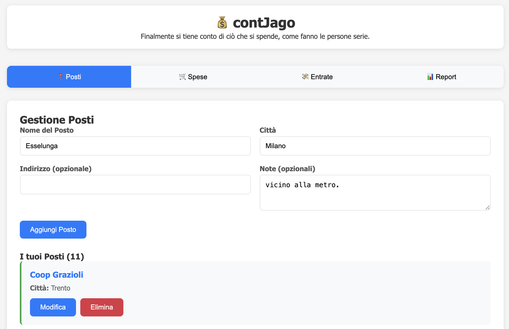
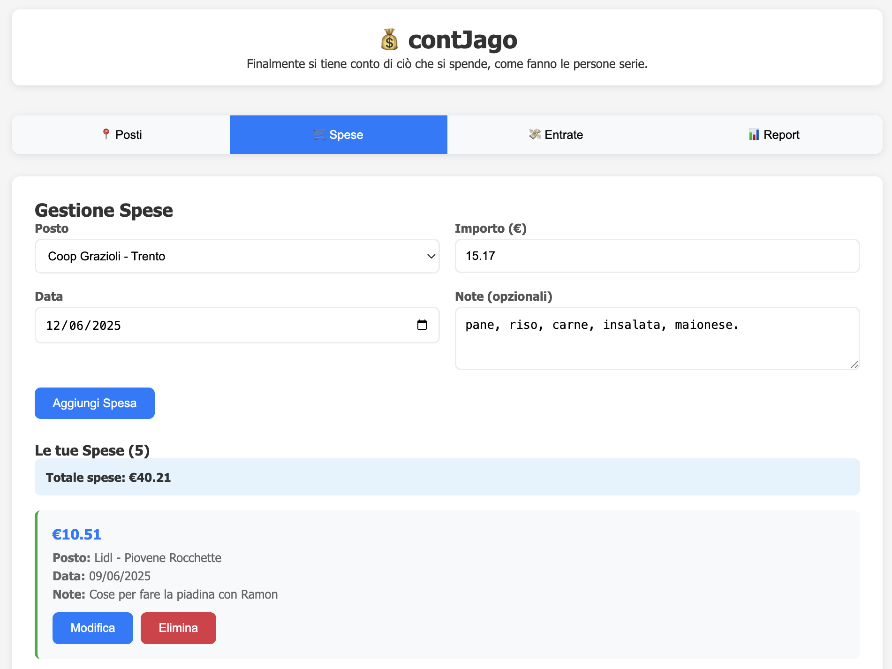
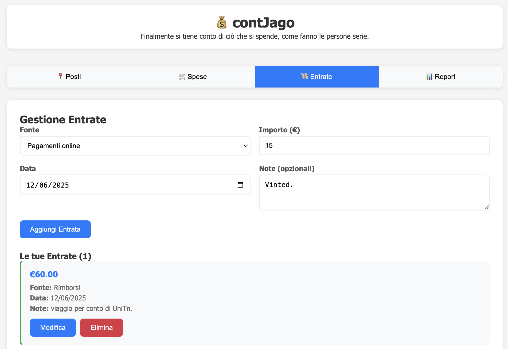
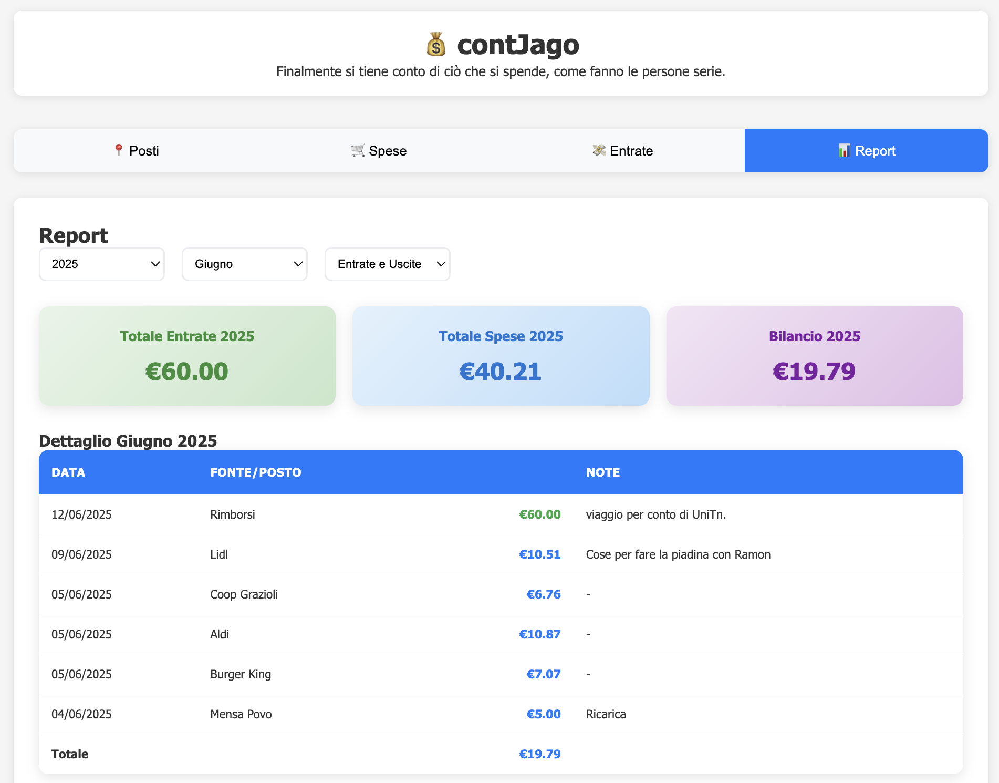

# 💰 contJago

**contJago** is a personal finance management application designed to track expenses, incomes, and generate detailed reports. 
The project provides an intuitive interface for managing financial data, offering insights into monthly and yearly balances.

---

## Features

### 📍 **Places Management**
- Add, edit, and delete places where expenses occur.
- View a list of all places with relevant details.



### 🛒 **Expenses Management**
- Record expenses with details such as amount, date, place, and notes.
- Edit or delete expenses as needed.
- View expenses grouped by month or year.



### 💸 **Incomes Management**
- Record incomes with details such as source, amount, date, and notes.
- Edit or delete incomes as needed.
- View incomes grouped by month or year.



### 📊 **Reports**
- Generate detailed reports for selected months or entire years.
- Filter reports to show:
  - Only incomes
  - Only expenses
  - Both incomes and expenses
- View monthly and yearly balances.
- Interactive filters for selecting periods and report types.



---

## 🛠️ Technologies Used

### Backend
- **Node.js**: Server-side runtime.
- **Express.js**: Web framework for handling routes and middleware.
- **MongoDB**: Database.
- **Mongoose**: ODM for MongoDB.

### Frontend
- **Vue.js**: Reactive framework for building the user interface.
- **Axios**: HTTP client for API calls.

### Styling
- **CSS**: Custom styles for a clean and responsive design.

---

## 🚀 Installation

### Prerequisites
- `Node.js` and `npm` installed.
- MongoDB instance running locally or remotely.

### Steps
1. Clone the repository:
   ```bash
   git clone https://github.com/contJago/contJago.git
   ```
2. Navigate to the project directory:
    ```bash
    cd contJago
    ```
3. Install dependencies:
    ```bash
    npm install
    ```
4. Create a `.env` file in the `root` directory and configure the following variables:
    ```bash
    API_BASE_URL=...
    MONGO_URI=mongodb+srv://<username>:<password>@<cluster-url>/<database-name>
    PORT=...
    ```
5. Start the server:
    ```bash
    npm start
    ```

---

## 📂 Folder Structure
    
    contJago/
    ├── models/          # Mongoose models for database
    │   ├── income.js    # Income schema
    │   ├── place.js     # Place schema
    │   └── purchase.js  # Purchase schema
    ├── routes/          # Express routes
    │   ├── routeIncome.js   # Routes for incomes
    │   ├── routePlace.js    # Routes for places
    │   └── routePurchase.js # Routes for purchases
    ├── webapp/          # Frontend files
    │   ├── css/         # Stylesheets
    │   │   └── style.css
    │   ├── js/          # JavaScript files
    │   │   └── app.js   # Vue.js application logic
    │   └── index.html   # Main HTML file
    ├── .env             # Environment variables
    ├── index.js         # Main server file
    ├── package.json     # Project metadata and dependencies
    └── README.md        # Project documentation

---

## 🌟 Future Improvements
- **🔒 User Authentication**: Add secure login and user-specific data management.
- **📈 Data Visualization**: Implement charts and graphs for better insights into financial data.
- **📤 Export Functionality**: Allow users to export reports as PDF or Excel files.
- **📱 Mobile Optimization**: Improve responsiveness and usability on mobile devices.

---

## 📜 License
This project is licensed under the **MIT License**.  
You are free to use, modify, and distribute this software as long as the original copyright notice is included. See the `LICENSE` file for more details.

